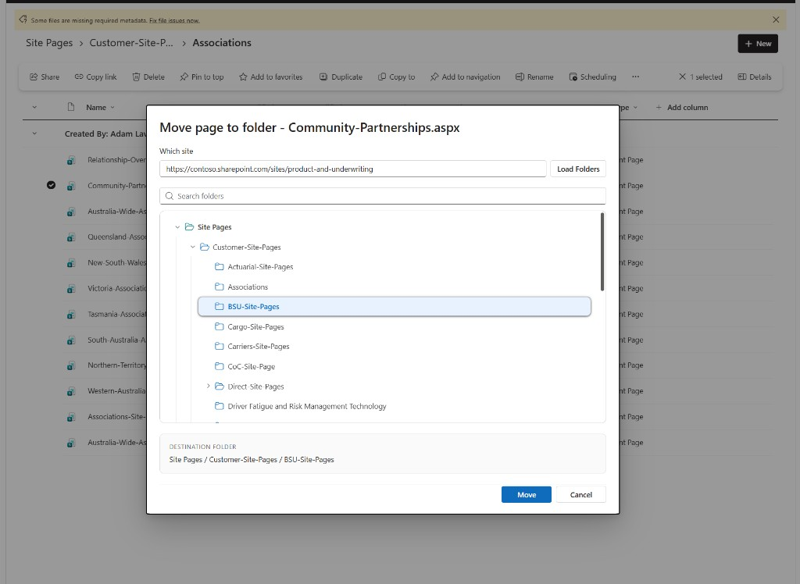

# Site Pages — Move to Folder

SPFx **List View Command Set** that adds a **Move to folder** action to the Site Pages library. Select one or more modern pages (`.aspx`), optionally choose another site, pick a destination folder in a searchable tree dialog, and move the file(s) with PnPjs.

| | |
| --- | --- |
| **Author** | [Kachihro](https://www.kachihro.com) |
| **Website** | [www.kachihro.com](https://www.kachihro.com) |
| **SPFx** | 1.23.0 |
| **Node** | `>=22.14.0 < 23.0.0` |
| **UI** | Fluent UI React v9 |
| **Data** | PnPjs (`@pnp/sp`) |


---

## Screenshot



*Move page to folder dialog — site picker, searchable Site Pages folder tree, destination summary, Move / Cancel actions.*

---

## Functional

### Purpose

Give content owners and site authors a first-class way to **reorganize Site Pages into folders** — including **multiple pages at once** and **cross-site moves** — without leaving the Site Pages library or using File Explorer / Power Automate.

### End-user journey

1. Open the site **Site Pages** library (any view that shows list items).
2. Select **one or more** modern pages (`.aspx`). Every selected row must be an eligible page (mixed selections with folders or non-pages hide the command).
3. Choose **Move to folder** from the command bar or context menu.
4. In the dialog:
   - Review the page name (single) or selected pages list / count (multi).
   - Optionally change the **destination site** URL and click **Load Folders**.
   - Optionally **search** folders by name.
   - Browse the **Site Pages** folder tree (including the library root).
   - Confirm the **Destination folder** summary.
5. Click **Move**.
6. On full success, the view **reloads**. On partial multi-page failure, a warning stays in the dialog (moved pages are already gone; failed names are listed).

### Functional rules

| Area | Behavior |
| --- | --- |
| Scope | Site Pages library only (list URL ends with `/SitePages`) |
| Selection | One or more eligible pages; **all** selected rows must qualify |
| Eligible items | Files ending in `.aspx`; folders are ignored |
| Excluded items | Pages under `/SitePages/Templates/` |
| Destination site | Current site by default; paste another HTTPS site URL and load its folders |
| Destination folder | Any eligible folder under that site’s Site Pages, including the root |
| Same folder | Blocked when every selected page is already in the chosen folder **on the same site** |
| System folders | `Forms` and root-level `Templates` are not shown as destinations |
| Multi-move | Pages move sequentially; partial success reports `Moved X of Y` with failed file names |
| Cross-site | Same-site uses `moveByPath`; cross-site uses absolute-destination `moveByPath`, with a clientside-page copy fallback if MoveCopyUtil is blocked |
| Failure | Load/move errors surface in the dialog; user can cancel or retry |

### Multi-select

| Rule | Detail |
| --- | --- |
| Visibility | Command appears only when **every** selected row is a movable `.aspx` page |
| Mixed selection | Selecting a folder, document, or Templates page with pages **hides** the command (no partial eligibility) |
| Dialog title | Single: `Move page to folder - {fileName}` · Multi: `Move pages to folder - {N} pages selected` |
| Summary | Multi shows a **Selected pages** list (comma-separated file names) |
| Current folder | Shared current folder when all pages share one; otherwise treated as library root for tree expand defaults |
| Same-folder guard | Blocks only when **all** selected pages already live in the destination folder (same site) |
| Move execution | `movePages()` moves each page in order; continues after individual failures |
| Partial failure | Warning in dialog; list does **not** auto-reload so the user can read failures |
| Total failure | Error thrown / shown; dialog stays open |

### Cross-site destination

| Rule | Detail |
| --- | --- |
| Default | Destination site field is prefilled with the current web URL; folders load for the current site |
| Other site | Paste an HTTPS SharePoint site URL → **Load Folders** (or Enter) |
| Validation | Invalid / non-HTTPS URLs show an inline message |
| Resolution | Service resolves the target web’s Site Pages library, then loads its folder tree |
| Permissions | User needs access to the destination site and Site Pages library |
| Custom script | **IMPORTANT:** cross-site `.aspx` moves often need Custom script **allowed** on the destination (`DenyAddAndCustomizePages` = false); see Prerequisites |
| Same-folder | Same-folder block applies only for same-site destinations |

### When the command appears

The **Move to folder** command is **hidden by default** and only becomes visible when all of the following are true:

| Condition | Rule |
| --- | --- |
| Library | Current list server-relative URL ends with `/SitePages` |
| Selection | At least one row selected, and **every** selected row is eligible |
| Item type | Not a folder (`FSObjType` / `FileSystemObjectType` ≠ `1`) |
| File type | `FileLeafRef` ends with `.aspx` |
| Templates | Path must **not** contain `/SitePages/Templates/` |

If any selected row fails a check, the command stays hidden.

---

## Features / Benefits

| Feature | Benefit |
| --- | --- |
| **Multi-select move** | Reorganize many pages to one folder in a single action |
| **Cross-site destination** | Move pages to another site’s Site Pages library by URL |
| **In-library Move to folder command** | Reorganize without switching tools or leaving SharePoint |
| **Searchable folder tree** | Find deep destinations quickly in large Site Pages hierarchies |
| **Site Pages root as a destination** | Move pages back to the library root in one step |
| **Prefetched folder cache** | Dialog opens faster after the first valid selection (current site) |
| **Same-folder guard** | Prevents no-op moves when all pages are already there |
| **Partial-failure reporting** | Know which pages moved and which failed |
| **System folder filtering** | Hides `Forms` / `Templates` so authors only see real content folders |
| **Inline load & move errors** | Clear feedback without cryptic browser failures |
| **Fluent UI v9 dialog** | Familiar Microsoft 365 look and feel |
| **Tenant-friendly packaging** | `skipFeatureDeployment` supports App Catalog / tenant-wide rollout |

**Who benefits**

- **Site owners / content managers** — keep page IA tidy as sites grow; bulk-move into folders.
- **Authors** — fix “wrong folder” or “wrong site” mistakes without IT or PowerShell.
- **Admins / developers** — drop-in SPFx extension with clear eligibility rules and PnPjs move semantics.

---

## Technical

### Stack

| Layer | Technology |
| --- | --- |
| Platform | SharePoint Framework **1.23.0** (Heft web build rig) |
| Extension type | **List View Command Set** (`MovePageToFolderCommandSet`) |
| UI | React 17 + **Fluent UI React Components v9** + `@microsoft/sp-dialog` |
| SharePoint data | **PnPjs** `@pnp/sp` (folders, `moveByPath`, clientside pages fallback) |
| Runtime | Node **22.x** for build; browser against SharePoint Online |
| Package | `.sppkg` via `heft package-solution` |

### Architecture

```text
List view selection change
        │
        ▼
┌───────────────────────────────┐
│ Update command visibility     │
│ Require all rows eligible     │
│ Prefetch folder tree (cache)  │
└───────────────┬───────────────┘
                │ user clicks "Move to folder"
                ▼
┌───────────────────────────────┐
│ Open MovePageToFolderDialog   │
│ pages[] + destination site URL│
│ Load folders (current/other)  │
│ User selects destination      │
└───────────────┬───────────────┘
                │ Move
                ▼
┌───────────────────────────────┐
│ SitePagesFolderService        │
│ movePages(...) sequentially   │
│ same-site / cross-site path   │
└───────────────┬───────────────┘
                │ full success
                ▼
          Reload page
```

### Components

| Component | File | Role |
| --- | --- | --- |
| Command set | `src/extensions/movePageToFolder/MovePageToFolderCommandSet.ts` | Visibility, multi-select parsing, dialog orchestration, post-move reload |
| Dialog | `src/extensions/movePageToFolder/dialogs/MovePageToFolderDialog.tsx` | Site URL + Fluent tree/search UI, multi-page copy, same-folder check |
| Service | `src/extensions/movePageToFolder/services/SitePagesFolderService.ts` | Folder tree, cache, same-/cross-site move, `movePages` batch |
| Types | `src/extensions/movePageToFolder/types.ts` | `IFolderNode`, `ISelectedPageInfo`, `IMovePagesResult`, … |
| Strings | `src/extensions/movePageToFolder/loc/` | Localized UI labels (single + multi + cross-site) |
| Manifest | `MovePageToFolderCommandSet.manifest.json` | Command id `MOVE_TO_FOLDER`, icon |

### Command set logic

- Subscribes to `listViewStateChangedEvent` and toggles command visibility.
- Builds `ISelectedPageInfo[]` from **all** `selectedRows` (`FileLeafRef`, `FileRef`, folder object type). Mixed ineligible selection → empty array → command hidden.
- Prefetches the current-site folder tree when a valid selection exists (stale-request guarded with a request id).
- Ensures only one dialog instance is active.
- On full successful move (`dialog.didMove`), calls `window.location.reload()`. Partial multi-move success returns a warning string and does **not** reload.

### Service logic

- Loads child folders recursively under the Site Pages library URL.
- Caches the tree and coalesces concurrent `getFolderTree()` calls for the bound web.
- Resolves another site via `createForSite` / `loadFoldersForSite` / `resolveSitePagesLibrary`.
- **Same site:** `getFileByServerRelativePath(source).moveByPath(destinationFileUrl, true)`.
- **Cross site:** `moveByPath` to an absolute destination URL; on failure, clientside-page copy + cleanup fallback.
- **Batch:** `movePages()` loops pages, collecting `movedCount`, `results`, and `failures`.

**Folder exclusions**

| Depth | Excluded names |
| --- | --- |
| Root (`Site Pages`) | `Forms`, `Templates` |
| Nested folders | `Forms` |

### Dialog logic

- Synthetic **Site Pages** root node for moves to the library root.
- Destination site field + **Load Folders**; auto-loads current site on open.
- Search filters by folder name and keeps ancestors of matches.
- Default open state expands ancestors of the shared current folder (same site only).
- Blocks same-folder moves when all selected pages already sit in that folder on the same site.
- Disables dismiss while moving.
- Includes a Tabster compatibility patch for SPFx + Fluent UI v9 dialog hosting ([sp-dev-docs #10876](https://github.com/SharePoint/sp-dev-docs/issues/10876)).

### Solution layout

```text
src/extensions/movePageToFolder/
├── MovePageToFolderCommandSet.ts          # Visibility + multi-select + orchestration
├── MovePageToFolderCommandSet.manifest.json
├── types.ts                               # IFolderNode, ISelectedPageInfo, IMovePagesResult, …
├── icons/move-to-folder.svg
├── loc/                                   # Localized strings
├── dialogs/MovePageToFolderDialog.tsx     # Site picker + folder tree dialog
└── services/SitePagesFolderService.ts     # Folder tree + same-/cross-site move
```

### Package identity

| | |
| --- | --- |
| Solution id | `40489416-24b2-459f-974a-4c09f186d144` |
| Component id | `9059cbd7-7e32-4692-9bfc-7898d89ffaf7` |
| Command id | `MOVE_TO_FOLDER` |
| Debug locations | Command bar + context menu configs in `config/serve.json` |

---

## Prerequisites

- Node.js **22.x** (see `engines` in `package.json`)
- A Microsoft 365 developer / work tenant with SharePoint Online
- Permissions to deploy SPFx packages (App Catalog) and use Site Pages
- For cross-site moves: access to the destination site (see **IMPORTANT** below)
- For local debugging: ability to load scripts from `https://localhost:4321`

> **IMPORTANT — Cross-site moves and custom script**
>
> Moving Site Pages (`.aspx`) to **another site** can fail with a generic “Moved 0 of N” / Access Denied style error when the destination has **Custom script blocked** (`DenyAddAndCustomizePages` = true). This is a SharePoint Online tenant/site setting, not a bug in the extension.
>
> A SharePoint admin must **allow custom script** on the **destination** site (set `DenyAddAndCustomizePages` to `$false`). Example:
>
> ```powershell
> # Microsoft 365 CLI
> m365 spo site set --url "https://contoso.sharepoint.com/sites/destination" --noScriptSite false --wait
>
> # Or SharePoint Online Management Shell
> Connect-SPOService -Url "https://contoso-admin.sharepoint.com"
> Set-SPOSite -Identity "https://contoso.sharepoint.com/sites/destination" -DenyAddAndCustomizePages $false
> ```
>
> That site setting often **auto-reverts to blocked within ~24 hours**. Same-site folder moves do not require this. The extension also tries a modern Site Pages copy fallback when MoveCopyUtil is blocked, but admin-allowed custom script remains the reliable fix for stubborn destinations.

---

## Minimal path to awesome

```bash
# Install dependencies
npm install

# Trust the SPFx local cert (first time only, globally)
npx gulp trust-dev-cert
# or, with Heft tooling as used by this project, follow your SPFx 1.23 local HTTPS setup

# Start local serve (debug against Site Pages)
npm start
```

Update `config/serve.json` `pageUrl` to your tenant’s Site Pages view if needed (default targets `.../SitePages/Forms/ByAuthor.aspx`).

### Build package

```bash
npm run build
```

This runs production tests/build and packages the `.sppkg` under `sharepoint/solution/` (see `config/package-solution.json`).

### Deploy

1. Upload the `.sppkg` to the tenant (or site) **App Catalog**.
2. Deploy / trust the package (`skipFeatureDeployment` is enabled — tenant-wide deployment friendly).
3. Add the app to the site (if not tenant-deployed), or ensure the List View Command Set is associated with Site Pages.
4. Open **Site Pages**, select one or more pages, and use **Move to folder**.

Debug serve configuration includes both **command bar** and **context menu** registrations.

---

## Notes & limitations

- **IMPORTANT — Cross-site / custom script** — see the Prerequisites callout. Destination sites with Custom script blocked (`DenyAddAndCustomizePages`) often reject `.aspx` moves; an admin must allow custom script on the destination (setting may revert within ~24 hours).
- **Multi-select requires a clean selection** — every selected row must be a movable page; mixed folders/files hide the command.
- **Site Pages only** — command does not appear in other libraries.
- **Templates excluded** — pages under `SitePages/Templates` cannot be moved with this command.
- **Same-folder move** — blocked on same site when all selected pages are already in the destination; choose a different folder or site.
- **Partial multi-move** — some pages may move while others fail; the dialog shows counts and failed names without reloading.
- **Overwrite** — `moveByPath` uses overwrite semantics; colliding file names at the destination follow SharePoint overwrite behavior.
- **Reload after full success** — a full page reload refreshes the list view after a complete successful move.

---

## Version history

| Version | Date | Comments |
| --- | --- | --- |
| 1.0.0.0 | 2026 | Initial release with multi-select and cross-site destination |

---

## Author

**Kachihro**  
Website: [https://www.kachihro.com](https://www.kachihro.com)

---

## Disclaimer

**THIS CODE IS PROVIDED _AS IS_ WITHOUT WARRANTY OF ANY KIND, EITHER EXPRESS OR IMPLIED, INCLUDING ANY IMPLIED WARRANTIES OF FITNESS FOR A PARTICULAR PURPOSE, MERCHANTABILITY, OR NON-INFRINGEMENT.**

---

## References

- [SharePoint Framework overview](https://docs.microsoft.com/sharepoint/dev/spfx/sharepoint-framework-overview)
- [List View Command Set extensions](https://docs.microsoft.com/sharepoint/dev/spfx/extensions/get-started/building-simple-cmdset-with-dialog-api)
- [PnPjs](https://pnp.github.io/pnpjs/)
- [Fluent UI React v9](https://react.fluentui.dev/)
- [Microsoft 365 Patterns and Practices](https://aka.ms/m365pnp)
- [Heft documentation](https://heft.rushstack.io/)
